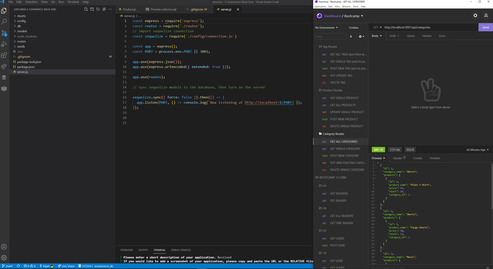

# E-Commerce Back End [")](https://opensource.org/licenses/MIT)
  
  ## Description
  This project allows a user to externally read, write, update, and delete from a database, via Express routing and Sequelize object-relational-mapping. It was a great exercise in combining express and sequelize to gain a better understanding of both. 

### Technologies used:

* Express
* Sequelize

**_Click [HERE](https://www.youtube.com/watch?v=LfrzUivBd2M "E-Commerce Back End Walk Through Video") to view the E-Commerce Back End Walk Through Video, or by copying and pasting the following link: https://www.youtube.com/watch?v=LfrzUivBd2M_**
  
  

  ---
  ## Table of Contents
1. [Usage](#usage)
1. [Contribution](#contribution)
1. [License](#license)
1. [Questions](#questions)

  ---
  
  ## Usage
    
The application is initialized and the server is launched by entering:

```bash
node server.js
```

Once the server is launched, you can then send http requests to the server via PostMan or Insomnia to access the data contained within. 

This data is arranged in 3 tables:

* Categories - product categories that each product will fall under.

* Products - the actual product containing price, stock, title, etc. 

* Tags - metadata that can link products together via specific attributes (ex. a bicycle and a hat could both have the "blue" tag.)

There is also a fourth junction table that details the many to many relationship between product and tag, called productTag. 

## HTTP REQUEST NOTES

* **GET** requests can either go straight to the endpoint (to return all data) or specify an ID after the end point to return data on only a specific entry.
 (Ex: http://localhost:3001/api/categories/1 to return only the data on the category with an ID of 1.) 

* **POST** requests, in addition to specifying the ID in the url beyond the basic endpoint, must contain all information for their relevant model in the body, excluding auto-incrementing attributes (such as the id primary key).

* **PUT** requests must contain the information that is desired to be updated only, with the exception of tags on products, in which all existing tags must also be enumerated. Updating tags on a product will completely wipe existing tags and replace with the request. This is because to update the many to many relationship between tags and products, the relationship entries in the productTag table will be wiped and re-created.

* **DELETE** requests need to specify the ID of the entry to be deleted. A request body is not needed.

## ACCESSING SPECIFIC MODELS

* **Category** routes are accessed via the **/api/categories** endpoint. a further **/:id** can be added onto the end for reading, modifying, or deleting specific categories. 

* **Product** routes are accessed via the **/api/products** endpoint. a further **/:id** can be added onto the end for reading, modifying, or deleting specific products.

* **Tag** routes are accessed via the **/api/tags** endpoint. a further **/:id** can be added onto the end for reading, modifying, or deleting specific categories. 


---

## Contribution
    
Thank you for considering contributing to this project. If you would like to contribute, feel free to fork the repository, add your functionality or bugfix, and submit a pull request. I will review the changes and contact you with any questions or concerns.

---

## License
  
  This application is licensed under **The Massachusets Institute of Technology License (MIT)**.
  
  Click the license badge below for more information and usage guidelines:
  
  [")](https://opensource.org/licenses/MIT)
  
  Click [here](https://www.mit.edu/~amini/LICENSE.md
  "MIT Full Terms and Conditions") to view the full terms and conditions text of MIT.
  
  ---
  
  ## Questions
  
Please do not hesitate to reach out with any questions you may have. I can be reached in the following ways:

* Email: [ElijahARomer@gmail.com](mailto:ElijahARomer@gmail.com)
* GitHub: [ElijahRomer](http://www.github.com/ElijahRomer)


Thank you for reaching out and I look forward to getting in touch with you soon!


